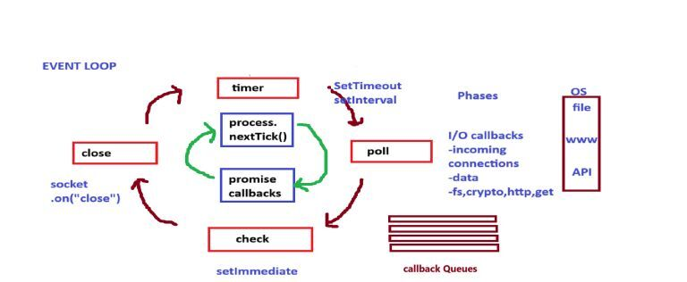

# nodejs - Run JavaScript Everywhere, JS can't wait, run synchronous code

	- It is runtime environment of JS build on V8, run JS outside browser - 2009 developed by ryan dahl
	- It is cross platform (run on all platform), open-source (maintained by openjs community)
	- It is based on V8 Engine (Same used in Chrome browser) + libuv (Asynchronous I/0 (non blocking I/0), Event driven architecture, Thread pool + etc) + more super powers (APIs and all).

## JS run on Server

	Server - It is computer with some configuration and placed remotely to handle some client request. 

	Intially JS was only run on browser - Client side only 
	Now JS can run on any machine - JS is everywhere in Web, desktop, mobile, Watch, TV, any device where we can integrated js engine.

	V8 code is most of code written in c++ only.
	V8 uses 
	
		ECMAScript (Standard which is followed by scripting language like JS) managed by TC39 and 
		
		WebAssembly (low-level binary instruction format that allows developers to run high-performance applications directly in web browsers at near-native speeds. It acts as a portable compilation target for languages like C, C++, and Rust, allowing you to bring heavy processing to the web).

	V8 can be emebedded on any c++ application. - It is invention of node JS

## Souce code

	Most of programming language uses c++/c code for communicating the OS, High level language (JS) it is compile into machine level code which support OS. 

	- Level of layer for JS code	
	
	JS - HIgh level code (C++ or C) - Low level code [Machine code - Assembly code] - Computer (Binary code 1010101.. )

## Install and Verify nodeJs

	- Download nodejs - Choose OS, Version

		- nvm - node verion manager (with command)
		- prebuild installer ...

		- I have installed node via docker we need to start docker desktop and create a container

	- Verify

		- node -v = version of node else need to install node
		- npm -v - it is package manager got installed automatically on installation of node

## Node REPL (READ EVALUATE, PRINT, LOOP)

	It is given a program prompt we can run the nodejs code something like console of browser.
	type node and try the code like simple calculation and all

## Global Object

	global - console.log(global) - It is nodeJS part not a V8 part, it is samilar like this, window, frames and self of browser

	console.log(this) - it prints in empty object but when use REPL it point to the global object

	JS community decided some common global object they released 2018/2049 -  globalThis

## require and module.exports is use to execute multiple module (files) from single entry points

	- require - we can un the file but we can't access variable and functions (Modules protectes thier variables and functions from leaking)
	- we can use exports and allow varible and function to be use in other file with getting in it.

		=> module.exports = <varaible>|<function> - Module file
		=> const data = require('./<filename>) - Base file 

	Why 

		- Module has is private space and if we allow other module to access so it will be problem with thier private space.

	There is 2 types of module systems 	

	- CJS (Common JS) - module.exports and require, by default in nodeJS - older way - Synchronous - Non strict mode

		Used in node 

			module.exports = ...
			in package.json { "type": "commonjs" } - no need to use but if we use package.json so we can use type

	- MJS (ECMAScript Modules) - import and export - by default used in react, angular, next js - newer way - ASynchronous - Non strict mode

		import and export
		in package.json { "type": "module" }

## **IIFE (Immediately Invoked Function Expression)**

	When we use require it it uses IIFE - It invoke the code and create priavate scope

	(function (module, require){ // it has more paramete which is given by
		reuire module code wrap inside here
	})(module, )  

	- How are variable and function can't access in different file becaue of IIFE

## What happen when we use require 

	- Resolving the module (from where the data is coming like .js/ .json)
	- Loading the module (loading the data of the module )
	- Wrap inside IIFE (create IIFE for the module)
	- Evalution (module.exports )
	- Caching (if same module require more than one area, node caches require so it will run only once)

## libuv - Multi-platform support, Asynchronous I⁠/⁠O made simple

	NodeJS support - event-driven architecture and capable of aynchronous I/O with help of libuv
	JS uses single threaded and capable of running only synchronous

	NodeJS can do asynchronous with help of libuv.
	libuv can do File access, DB access, API, TImer and more (JS offload the Asynchronous task to libuv)

	